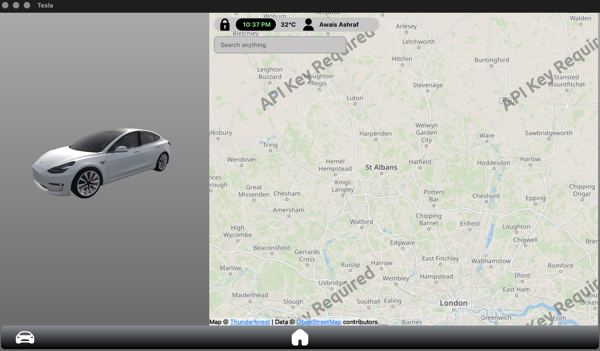

# Tesla-Media-Control-Unit-central-touchscreen-Ui

A Tesla-inspired automotive infotainment system built using C++, Qt 6, and QML, designed to replicate the experience of a modern vehicle touchscreen interface. The project focuses on creating a responsive and visually polished HMI with a centralized interface for navigation, climate control, media, vehicle information, and system settings.

